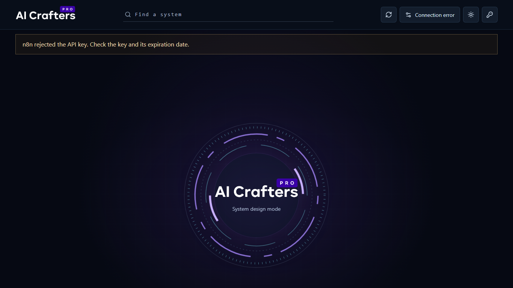
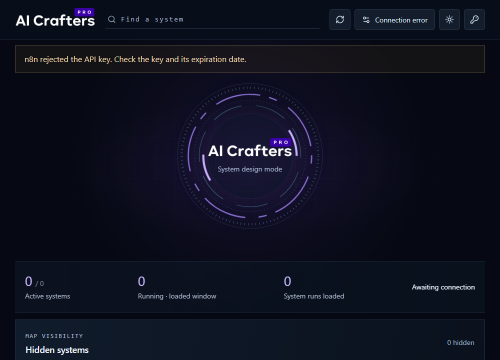

# AI Crafters Pro

AI Crafters Pro is the community operations interface for AI-powered workflows. It gives members one calm, visual place to connect an n8n workspace, see the systems that power their work, run them with intent, and understand what happened after each execution.

The application is designed to make automation approachable without hiding the real workflow behind it: n8n remains the source of truth for workflows, credentials, and execution history.

## Responsive dashboard layout

The operating map remains a full-width canvas when it is displayed beside a host sidebar. It only changes to the compact, stacked system list on tablet and phone widths, so the central map keeps its visual hierarchy in embedded previews.

| Wide dashboard | Sidebar-sized dashboard |
| --- | --- |
|  |  |

## What members can do

- **Connect a workspace** — add an n8n Cloud or publicly reachable self-hosted instance using an n8n API key.
- **See the operating map** — browse the AI Crafters Pro system catalogue and the workflows available to the connected account.
- **Operate systems** — start or pause a workflow from its system view, then follow the resulting execution.
- **Inspect agents and evidence** — view workflow nodes as agents, inspect their configuration and credentials, and open complete execution data when n8n reports it.
- **Review performance** — see recent run history, success rate, average duration, failures, and workflow status.
- **Use approval gates** — approve or reject a running workflow when it contains the supported `AI Crafters Pro Approval` POST webhook.
- **Build and refine workflows** — open the full-screen Workflow Studio to create, edit, arrange, save, import, or export n8n workflow drafts.
- **Manage connected services** — view credential metadata and open the connected n8n account to create or update credentials. Secret values never appear in this interface.

## The AI Crafters Pro systems

The dashboard maps workflows to a shared operating model:

1. Product & Market Intelligence
2. Store & Conversion
3. Creative Production
4. Paid Acquisition
5. Organic & Creators
6. Email Marketing
7. SMS Marketing
8. Customer Support
9. Fulfillment & Retention
10. Analytics & Growth

For a system to appear on the map, create an active or inactive n8n workflow with the corresponding name. Other workflows remain available in the workflow area, while the system map stays focused on this shared model.

## Quick start for community members

1. Open the dashboard and select **Connect n8n**.
2. Enter your public n8n base URL — for example, `https://your-team.app.n8n.cloud`.
3. In n8n, go to **Settings → n8n API**, create an API key, and paste it into the dashboard.
4. For a scoped API key, allow at least `workflow:list`, `workflow:read`, `workflow:update`, `workflow:activate`, and `execution:list`.
5. Choose a system from the map, review its agents, and select **Run System** when you are ready.
6. Use the execution drawer to review output, timing, and any error diagnosis.

> The dashboard calls the production webhook of a workflow when running it. If a workflow only has a connected Manual Trigger, the dashboard can add a dedicated run-trigger webhook so it can be operated from the interface.

## Local development

### Requirements

- Node.js 22.13 or later
- An n8n instance for integration testing (optional for UI work)
- A random 32-byte hex value for local credential encryption

Install dependencies and start the app:

```bash
npm install
npm run dev
```

Open the local address printed by the development server. The local preview supports an n8n instance at `http://localhost:5678`.

### Local connection storage

Copy `.env.example` to `.dev.vars` and set a unique encryption key:

```text
N8N_ENCRYPTION_KEY=<64-character random hexadecimal value>
```

Apply the local D1 migration before testing saved connections:

```bash
npm run db:migrate:local
```

Run the available checks with:

```bash
npm run lint
npm test
npm run build
```

## Security and privacy

Each signed-in dashboard account has its own saved n8n connection. The n8n API key is encrypted before it is stored, is hidden after connection, and is used server-side to communicate with the configured n8n instance. Credential names and types may be displayed for operational context; credential secret values remain in n8n.

Use a dedicated, least-privilege n8n API key. The dashboard validates n8n instance URLs and is intended for public HTTPS n8n domains in hosted environments. Disconnecting removes the saved connection from this dashboard; it does not change workflows or credentials in n8n.

## Community contribution guide

This interface is for the people who operate and improve AI Crafters Pro together. Contributions that make the dashboard clearer, safer, more accessible, or more useful are welcome.

Before opening a pull request:

1. Keep n8n as the source of truth—do not simulate execution status or expose credentials.
2. Preserve clear loading, empty, and error states for operators.
3. Run `npm run lint`, `npm test`, and `npm run build`.
4. Describe the member-facing change and include screenshots or a short recording for UI changes where helpful.

## Technology

- React 19 and Vinext
- TypeScript and Tailwind CSS
- Cloudflare Workers and D1 for the server-side n8n connection layer
- n8n Public API for workflow, execution, and credential metadata

## License

No license file is currently included. Please contact the AI Crafters Pro maintainers before reusing or redistributing this project.
